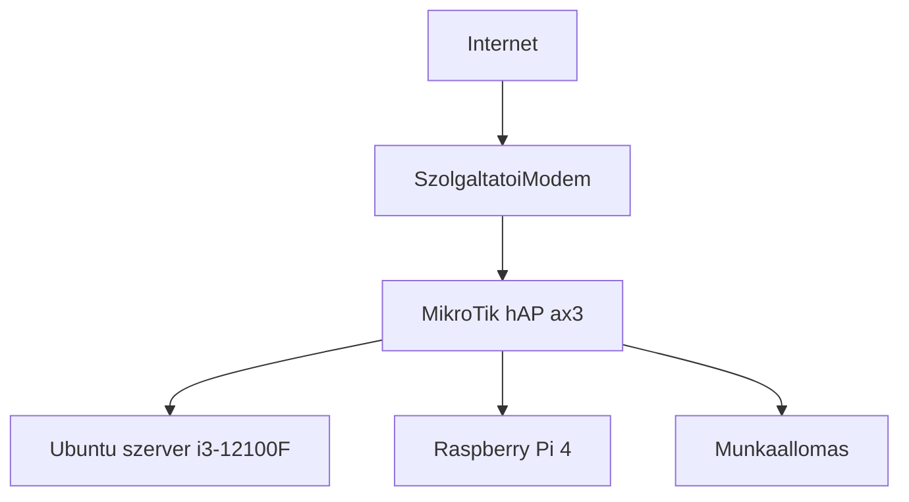
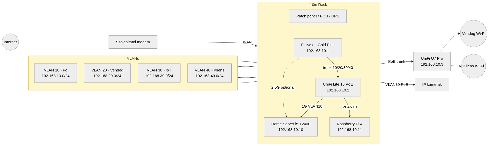
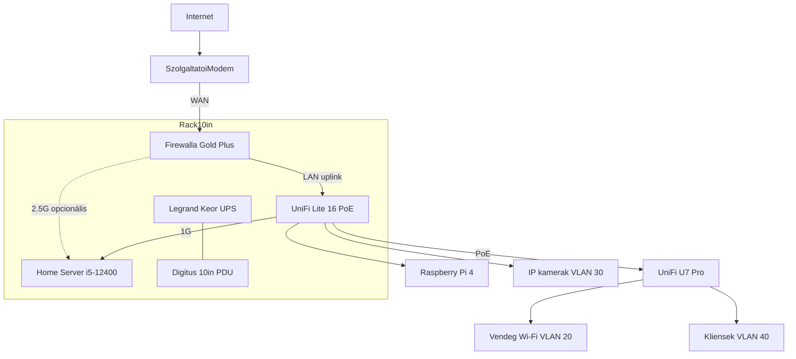

# 📊 Homelab hálózati topológia

## Induló állapot

A jelenlegi lab switch nélkül, MikroTik hAP ax³ routerrel fut. Ez a kiindulás, nem a cél.

### Induló IP-cím és port kiosztás

A címek a jelenlegi / tervezett VLAN 10 tartományra vannak előkészítve. A hAP ax³ a célállapotban kikerül.

| Eszköz / szolgáltatás | VLAN | IP-cím | Port | Protokoll | Megjegyzés |
|---|---|---|---|---|---|
| MikroTik hAP ax³ | 10 | 192.168.10.1 | - | - | Jelenlegi router / gateway — kivezetendő |
| Ubuntu fő szerver | 10 | 192.168.10.10 | 22 | SSH | Docker és KVM host |
| Raspberry Pi 4 | 10 | 192.168.10.11 | 53 | DNS | Pi-hole (elsődleges DNS) |
| Portainer GUI | 10 | 192.168.10.10 | 9000 | HTTP | Docker menedzsment |
| SWAG (Proxy) | 10 | 192.168.10.10 | 443 | HTTPS | SSL / reverse proxy |
| Authentik | 10 | 192.168.10.10 | 9443 | HTTPS | SSO |
| Nextcloud | 10 | 192.168.10.10 | 444 | HTTPS | Adatfelhő |
| Jellyfin | 10 | 192.168.10.10 | 8096 | HTTP | Médiaszerver |
| Home Assistant | 10 | 192.168.10.10 | 8123 | HTTP | Okosotthon |
| qBittorrent | 10 | 192.168.10.10 | 8080 | HTTP | Letöltő |
| Sonarr / Radarr | 10 | 192.168.10.10 | 8989 / 7878 | HTTP | Média automatizáció |
| Immich | 10 | 192.168.10.10 | 2283 | HTTP | Fotómentés |

## Végső állapot (2.6)

10" rack: Firewalla Gold Plus, UniFi Lite 16 PoE, UniFi U7 Pro, home server, UPS, PDU, patch panel.

Szerkeszthető forrás: `images/network-map-updated.mmd` (mermaid.ink / MkDocs mermaid).

### Végső IP-cím és port kiosztás

| Eszköz / szolgáltatás | VLAN | IP-cím | Port | Megjegyzés |
|---|---|---|---|---|
| Firewalla Gold Plus | 10 | 192.168.10.1 | - | Tűzfal / gateway / DHCP |
| UniFi Lite 16 PoE | 10 | 192.168.10.2 | - | Switch menedzsment |
| UniFi U7 Pro | 10 | 192.168.10.3 | - | Wi-Fi 7 AP |
| Ubuntu Server host | 10 | 192.168.10.10 | 22 | Docker és VM gazdagép, i5-12400 |
| Raspberry Pi 4 | 10 | 192.168.10.11 | 53 / 80 | Pi-hole DNS és Pi.alert |
| SWAG Proxy | 10 | 192.168.10.10 | 80 / 443 | HTTPS bejárat |
| Homepage | 10 | 192.168.10.10 | 3000 | Fő dashboard |
| Authentik | 10 | 192.168.10.10 | 9443 | SSO |
| Nextcloud | 10 | 192.168.10.10 | 444 | Fájlfelhő |
| Odoo / Paperless | 10 | 192.168.10.10 | 8069 / 8010 | Irodai alkalmazások |
| Jellyfin | 10 | 192.168.10.10 | 8096 | Médiaszerver (iGPU transcode) |
| qBittorrent | 10 | 192.168.10.10 | 8080 | Letöltő |
| Sonarr / Radarr / Prowlarr | 10 | 192.168.10.10 | 8989 / 7878 / 9696 | Média automatizáció |
| Immich | 10 | 192.168.10.10 | 2283 | Fotó backup |
| Home Assistant | 10 | 192.168.10.10 | 8123 | Okosotthon központ |
| Frigate / Scrypted | 10 | 192.168.10.10 | 5000 / 10443 | Kamera és AI |
| GitLab / n8n | 10 | 192.168.10.10 | 8081 / 5678 | DevOps |
| LibreNMS / Plausible | 10 | 192.168.10.10 | 8001 / 8002 | Monitorozás |
| Kali Linux VM | 10 | 192.168.10.50 | - | KVM |
| Teszt tűzfal VM | 10 | 192.168.10.51 | - | KVM |
| TraceLabs / CSILinux | 10 | 192.168.10.52+ | - | KVM |
| Vendég eszközök | 20 | 192.168.20.100+ | - | Vendég VLAN |
| IP kamerák | 30 | 192.168.30.100–110 | 554 | RTSP, IoT VLAN |
| Kliensek | 40 | 192.168.40.100+ | - | Kliens VLAN |
