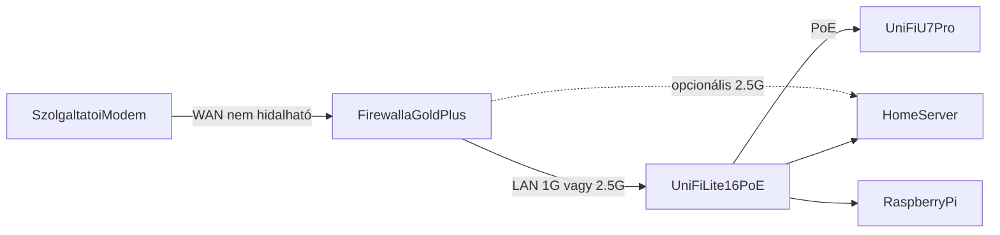

# Hálózati Tervezés

A hálózat központi eleme a Firewalla Gold Plus (tűzfal, routing, VLAN) és az UniFi Lite 16 PoE menedzselt switch. A Wi-Fi-t az UniFi U7 Pro adja. Ez a 2.6-os célállapot; a korábbi MikroTik (hAP ax³, RB5009, CSS610/CRS310) és az Asus RT-BE88U terv kikerül.

## Jelenlegi topológia

A hálózat csillag topológiában épül fel, switch nélkül. A bejövő kapcsolat a szolgáltatói modemről a MikroTik hAP ax³ WAN portjára megy, onnan a végkészülékekre. Az osztrák modem nem hidalható, ezért a MikroTik korlátozottan használható — ez a Firewalla csere egyik indoka.

## Célállapot

- **Firewalla Gold Plus:** WAN a modem mögött, L3 routing, tűzfal, VLAN-ok, DHCP. WAN mód (DHCP vs PPPoE) TBD, az ISP-től függ.
- **UniFi Lite 16 PoE:** L2 switching, port alapú VLAN, PoE az U7 Pro-nak. 16× 1 GbE — a switch nem 10G gerinc.
- **2.5G:** a home server két I226-V NIC-je. A 2.5G haszna elsősorban a Firewalla ↔ szerver közvetlen linken van; a switchen 1 GbE a limit.

Részletes bekötés: [Eszközök kötése](../network-setup/device-connections.md).

## Hálózati szegmentáció (VLAN terv)

A 2.0-es terv szerinti VLAN-ok. A Firewalla végzi a VLAN tagelést és az inter-VLAN routingot / tűzfalat.

| VLAN ID | Szerep | IP tartomány |
|---------|--------|--------------|
| 10 | Fő hálózat (szerverek, admin, munkaállomások) | 192.168.10.0/24 |
| 20 | Vendég | 192.168.20.0/24 |
| 30 | IoT (okoseszközök, kamerák) | 192.168.30.0/24 |
| 40 | Kliens | 192.168.40.0/24 |

Alapszabályok:

- VLAN 10 eléri a VLAN 30-at (Home Assistant, Frigate), fordítva nem.
- VLAN 20 (vendég) csak internetet kap, belső hálózatot nem.
- VLAN 40 (kliens) elkülönül az admin/szerver zónától; pontos inter-VLAN szabályok TBD.
- VLAN 30 IoT eszközeinek internete alapból tiltott, kivéve amihez kell (OTA, felhős híd).
